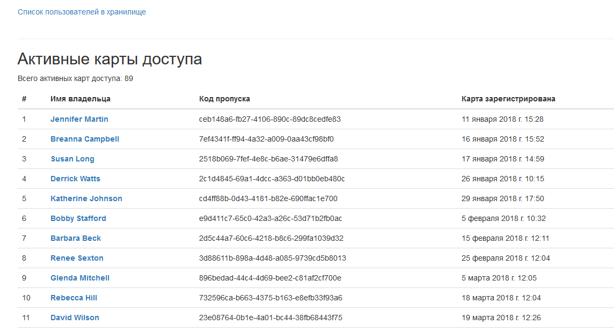

# Пульт охранника банка

---

Сайт на Django, подключённый к БД на проходной в банковском хранилище. Отображает информацию об активных пропусках и посетителях хранилища.

## Установка зависимостей
Первым делом, скачайте код:
``` 
git clone https://github.com/pas-zhukov/watching-storage.git
```
Для работы скрипта понадобятся библиотеки, перечисленные в `reqirements.txt`.
Их можно установить при помощи pip:
```
pip install -r requirements.txt
```
Проверить, что все необходимые библиотеки на месте:
``` 
pip list
```

## Запуск

1. Запускаем скрипт командой:
```
python main.py
```
2. Открываем сайт по ссылке [http://127.0.0.1:8000/](http://127.0.0.1:8000/)
3. Если всё сделано верно, откроется главная страница со списком активных пропусков:




Вкладка со списком людей в хранилище:


Если нажать на конкретного пользователя, можно получить данные о его визитах:


## Цели проекта

Код написан в учебных целях — это урок на курсе по Python и веб-разработке на сайте Devman.