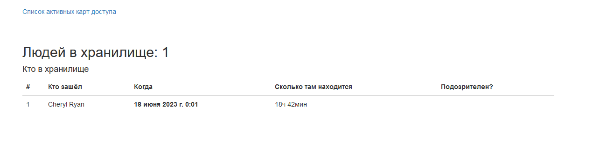

# Пульт охранника банка

---

Сайт на Django, подключённый к БД на проходной в банковском хранилище. Отображает информацию об активных пропусках и посетителях хранилища.

## Установка зависимостей
Первым делом, скачайте код:
``` 
git clone https://github.com/pas-zhukov/watching-storage.git
```
Для работы скрипта понадобятся библиотеки, перечисленные в `reqirements.txt`.
Их можно установить при помощи pip:
```
pip install -r requirements.txt
```

## Переменные окружения

Часть настроек проекта берётся из переменных окружения. Чтобы их определить, создайте файл `.env` рядом с `manage.py` и запишите туда данные в таком формате: `ПЕРЕМЕННАЯ=значение`.

Следующие переменные **обязательны** для корректной работы сайта, т.к. содержат данные для подключения к БД:
- `ENGINE` - Бэкенд для базы данных, используются стандартные. (Для postgres: `django.db.backends.postgresql`)
- `HOST` - Хост для подключения к БД.
- `PORT` - Конкретизирует, какой сетевой порт использовать.
- `NAME` - Название БД.
- `USER` и `PASSWORD` - имя пользователя и пароль соответственно.

Свободные переменные:
- `DEBUG` — дебаг-режим. Поставьте `True`, чтобы увидеть отладочную информацию в случае ошибки. Выключается значением `False`.
- `SECRET_KEY` — секретный ключ проекта. Например: `erofheronoirenfoernfx49389f43xf3984xf9384`.


## Запуск

1. Запускаем скрипт командой:
```
python manage.py runserver 0.0.0.0:8000
```
2. Открываем сайт по ссылке [http://127.0.0.1:8000/](http://127.0.0.1:8000/)
3. Если всё сделано верно, откроется главная страница со списком активных пропусков:


Вкладка со списком людей в хранилище:




Если нажать на конкретного пользователя, можно получить данные о его визитах:


## Цели проекта

Код написан в учебных целях — это урок на курсе по Python и веб-разработке на сайте Devman.